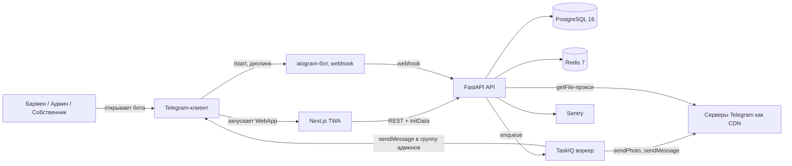

# Архитектура

## 1. Высокоуровневая диаграмма



## 2. Слои бэкенда (прагматичная Clean Architecture)

```
shiftops_api/
  domain/         чистый Python — сущности, value-объекты, тип Result, без IO
  application/    use case'ы (StartShiftUseCase, CompleteTaskUseCase, ...)
  infra/          SQLAlchemy-репозитории, TelegramStorage, aiogram-бот, очередь
  api/            FastAPI-роутеры + Pydantic-схемы
  config/         настройки (pydantic-settings)
```

- **Domain** никогда не импортирует из `application` или `infra`. Отдаёт
  `Result[T, Failure]` (Either-подобный), чтобы use case'ы не бросали
  исключений на бизнес-сбоях.
- **Application** оркестрирует: валидирует ввод, зовёт репозитории,
  возвращает `Result`.
- **Infra** реализует `Protocol`'ы, объявленные в `application`
  (storage, нотификации, репозитории).
- **API** — тонкая HTTP-обёртка: Pydantic in, вызов use case, HTTP out.

Эта граница делает всё тестируемым: use case'ы — это чистые async-функции
поверх протоколов репозитория и хранилища, фейки подключаются тривиально.

## 3. Изоляция арендаторов

- В каждой бизнес-таблице есть `organization_id uuid not null`.
- RLS-политика Postgres:
  `USING (organization_id = current_setting('app.org_id')::uuid)`.
- После валидации JWT зависимость `require_user` выставляет GUC через
  `set_config('app.org_id', …, true)` (см. `application/auth/deps.py`).
- На таблицах включён **FORCE RLS**: кросс‑арендные сценарии (обмен initData,
  redeem, супер‑админ в боте, `recurring_shifts_tick`) обходят политики только
  через `enter_privileged_rls_mode()` — см. раздел «FORCE RLS» в
  [SECURITY.md](SECURITY.md).

## 4. Абстракция хранилища

```python
class StorageProvider(Protocol):
    async def upload(self, file: bytes, mime: str, meta: dict) -> AttachmentRef: ...
    async def get_url(self, ref: AttachmentRef, ttl_seconds: int = 3600) -> str: ...
```

Две реализации:

- `TelegramStorage` (MVP) — заливает через
  `bot.send_photo(ARCHIVE_CHAT_ID, ...)`, хранит
  `(tg_file_id, tg_archive_chat_id, tg_archive_message_id)` и
  использует `forward_message` как fallback, если `getFile` вернул 404.
- `R2Storage` (V2) — presigned PUT/GET в Cloudflare R2.

DI-биндинг живёт в `infra/storage/provider.py` и выбирается по
переменной `STORAGE_PROVIDER`. Фронтенд никогда не знает деталей
провайдера — он всегда зовёт `GET /api/v1/media/{uuid}`, который
302-редиректит на временный URL.

## 5. Фоновые задачи

- TaskIQ-брокер поверх Redis.
- Задачи:
  - `send_telegram_message` — token bucket на чат (1 сообщение/сек на
    чат, 30/сек суммарно), чтобы не упереться в 429.
  - `send_telegram_media_group` — пакетирует до 10 вложений на закрытии
    смены.
  - `shift_reminders_tick` — раз в минуту, смотрит ближайшие смены и
    кладёт в очередь напоминания T-30 / T+15 / T-60.
  - `daily_digest_tick` — стреляет в 09:00 по часовому поясу каждой
    локации.

## 6. Поток аутентификации

Подробно в `AUTH_FLOW.md`. TL;DR:

1. TWA стартует с `Telegram.WebApp.initData`.
2. Фронтенд POST'ит на `/api/v1/auth/exchange` тело `{ "init_data": "<строка>" }`.
3. Бэкенд HMAC'ит её с `TG_BOT_TOKEN`, валидирует `auth_date`, ищет
   пользователя, выпускает JWT (access ~15 мин, refresh ~7 дней).
4. Продление сессии: `POST /api/v1/auth/refresh` с `refresh_token` (контракт см. в `auth.py` и фронте `refresh-access.ts`).

Управление участниками орг (смена ролей `admin` / `operator` / `bartender`,
деактивация) живёт в `application/team/` и эндпоинтах `/api/v1/team/*`.

**Политика доверия (пилот):** менять роли и деактивировать может только
**владелец** организации или **платформенный** super-admin
(`SUPER_ADMIN_TG_ID` в JWT `tg`); org `admin` видит команду в TWA, но флаги
`can_change_role` / `can_deactivate` для него ложные. Это сознательное
узкое горлышко по безопасности.

**Возможное расширение (после обратной связи пилотов):** разрешить org
`admin` переводить сотрудников **только** между линейными ролями
(`operator` ↔ `bartender`), без повышения до `admin` и без трогания `owner`
— отдельное изменение `can_manage_member` и доков.

**Должности без динамического RBAC (V1.1, см. `ROADMAP.md`):** опциональное
поле `users.job_title` (nullable, до 80 символов) для подписи в UI; права по-прежнему
задаёт только `users.role`.

## 7. Anti-fake пайплайн

Подробно в `SECURITY.md`. TL;DR:

- Серверный таймстемп на загрузке (часы клиента игнорируются).
- `Pillow` → `imagehash.phash` (16x16 DCT). Хранится как 64-битный hex.
- Сравнение с последними `ANTIFAKE_HISTORY_LOOKBACK` вложениями для
  `(template_task_id, location_id)`. Если расстояние Хэмминга ≤
  `ANTIFAKE_PHASH_THRESHOLD` — `suspicious=true` и алерт админу.
- Опциональное сравнение GEO с `location.geo` (радиус 200 м).

## 8. Architecture Decision Records

### ADR-001: Telegram Web App вместо нативного клиента (V0)

- **Статус:** принят.
- **Контекст:** операторам нужен онбординг без установки; персонал в
  HoReCa быстро ротируется.
- **Решение:** V0 поставляем как TWA. Принимаем урезанные оффлайн- и
  камерные возможности как осознанный компромисс.
- **Последствия:** оффлайн-очередь Service Worker'а — best-effort;
  нативное Flutter-приложение запланировано на V3.

### ADR-002: Хранилище только в Telegram + абстракция `StorageProvider` (V0)

- **Статус:** принят, с явным планом миграции на R2 в V2.
- **Контекст:** нулевой бюджет на хранилище для пилота.
- **Риски:** время жизни `file_id` формально не гарантировано; серая
  зона ToS.
- **Митигации:** всегда сохраняем `(archive_chat_id, archive_message_id)`,
  чтобы можно было `forward_message`'ом обновить `file_id`; держим
  `R2Storage` готовым за `Protocol`'ом, чтобы переключение было одной
  строкой DI.

### ADR-003: Один глобальный бот, мультиарендность в БД (V0)

- **Статус:** принят.
- **Контекст:** боты per-tenant ломают `file_id` TG-хранилища и
  добавляют трение онбординга.
- **Решение:** один `@ShiftOpsBot`. Контекст арендатора берётся из
  `initData` + БД, никогда не из идентичности бота. White-label-боты —
  фича Enterprise в V3.

### ADR-004: FastAPI + SQLAlchemy 2 async вместо Django

- **Статус:** принят.
- **Контекст:** workload async-нагруженный (Telegram API, fan-out из
  webhook'а).
- **Trade-off:** теряем Django-админку и эргономику ORM; получаем
  нативный async и типизированный domain-слой.

### ADR-005: TaskIQ вместо Celery

- **Статус:** принят.
- **Контекст:** нативная поддержка asyncio, меньший footprint, проще
  scheduler.
- **Риск:** сообщество меньше, чем у Celery.
- **Митигация:** задачи специально маленькие и изолированные —
  переезд на Celery, если понадобится, будет прямолинейным.

### ADR-006: Postgres RLS вместо фильтрации только в приложении

- **Статус:** принят.
- **Контекст:** defence in depth — защита от случайно забытого
  `WHERE organization_id = ?` в коде репозитория.
- **Trade-off:** миграции и тесты должны управлять
  `set_config('app.org_id')`.
