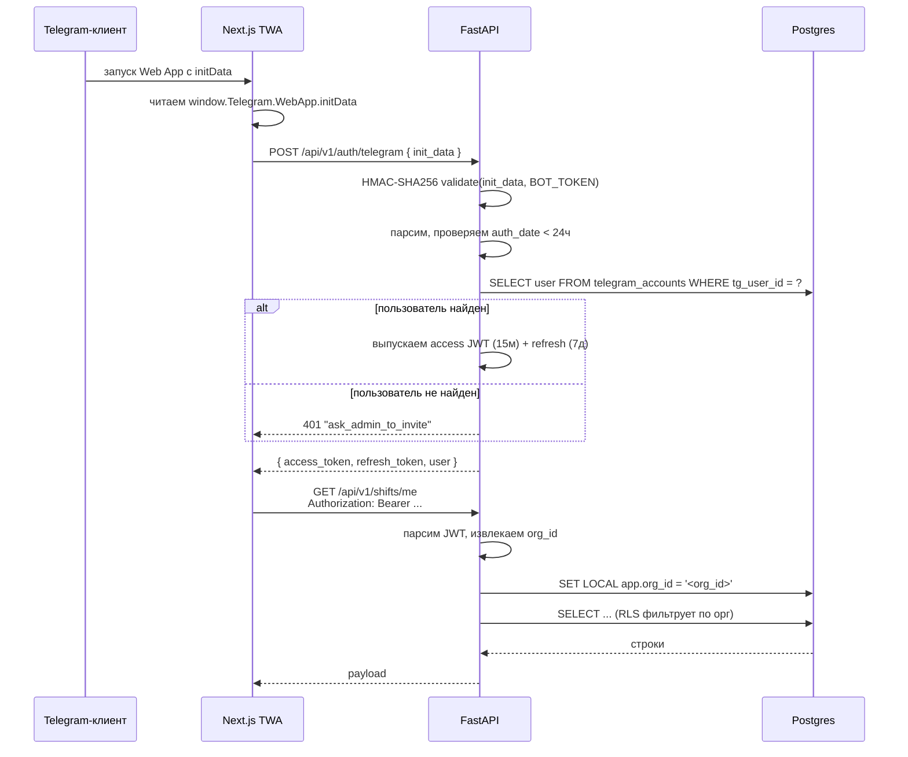

# Поток аутентификации — Telegram initData → JWT → RLS

## Последовательность



## Приглашения (инвайты)

1. Владелец или админ в TWA вызывает `POST /api/v1/invites` — в ответе `deep_link` вида `https://t.me/<bot>?start=inv_<token>`.
2. Сотрудник открывает ссылку: бот получает `/start` с payload `inv_<token>`.
3. `RedeemInviteUseCase` (модуль `shiftops_api.application.invites.redeem_invite`) в одной транзакции, после `SET LOCAL row_security = off` (тот же приём, что в `ExchangeInitDataUseCase`), создаёт строки `users` и `telegram_accounts` и помечает строку `invites` как использованную.
4. Дальше TWA: тот же `POST /api/v1/auth/exchange` с `initData` — пользователь уже в базе, JWT выдаётся штатно.

## Валидация initData

По [документации Telegram](https://core.telegram.org/bots/webapps#validating-data-received-via-the-mini-app):

1. Распарсить URL-декодированную строку `initData` в пары ключ→значение.
2. Извлечь поле `hash`.
3. Отсортировать оставшиеся пары по ключу.
4. Собрать `data_check_string`, склеив пары `key=value` через `\n`.
5. Посчитать `secret_key = HMAC_SHA256(b"WebAppData", BOT_TOKEN)`.
6. Посчитать `our_hash = hex(HMAC_SHA256(secret_key, data_check_string))`.
7. Сравнить `our_hash` с извлечённым `hash` constant-time-сравнением.
8. Проверить, что `auth_date` в пределах 24 часов от часов сервера —
   защита от replay.

Реализация живёт в `infra/telegram/init_data.py`.

## Формат JWT

```json
{
  "iss": "shiftops",
  "sub": "<user uuid>",
  "org": "<organization uuid>",
  "role": "operator",
  "tg": 123456789,
  "iat": 1714224000,
  "exp": 1714224900
}
```

- Подпись HS256 ключом `JWT_SECRET` (≥ 32 байт — проверяется в настройках).
- TTL access = 15 мин, TTL refresh = 7 дней.
- Refresh-токен также лежит в cookie `httpOnly; SameSite=Strict; Secure`,
  чтобы кража одного access-токена не позволяла выпустить новый.

## Middleware контекста арендатора

Каждый аутентифицированный запрос проходит через:

```python
@app.middleware("http")
async def tenant_context(request: Request, call_next):
    user = await resolve_user(request)
    request.state.user = user
    if user is not None:
        async with get_session() as session:
            await session.execute(
                text("SET LOCAL app.org_id = :org_id"),
                {"org_id": str(user.organization_id)},
            )
            request.state.session = session
    return await call_next(request)
```

`SET LOCAL` живёт в рамках транзакции и не утекает между запросами.
RLS-политики читают `current_setting('app.org_id', true)::uuid`.

## Тест межарендной изоляции

Живёт в `tests/test_rls_isolation.py`. Утверждает:

1. Запрос пользователя A никогда не возвращает строки, принадлежащие
   организации B.
2. Даже аутентифицированный запрос с инъекцией
   `WHERE organization_id = 'B'` возвращает 0 строк (RLS перебивает).
3. Триггер `audit_events_append_only` блокирует UPDATE / DELETE.
