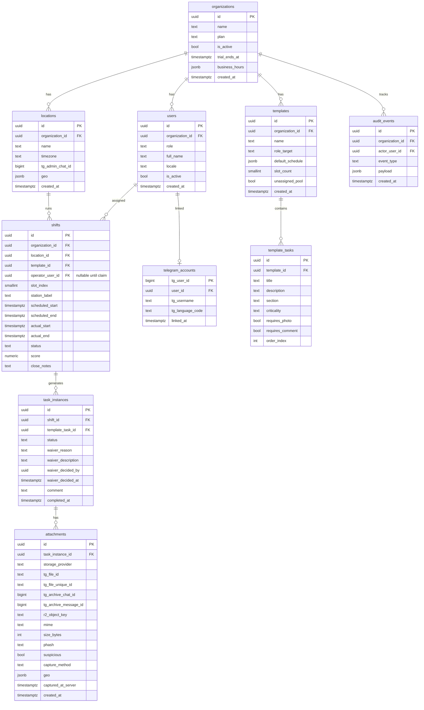

# Схема БД

PostgreSQL 16. UTF-8. Везде время в UTC через `timestamptz`.

## ERD



**V1.1:** колонка `users.job_title` (`VARCHAR(80)`, nullable) — подпись для UI
(«Шеф-повар» и т.п.), **без** влияния на RBAC; организация уже задаётся
`users.organization_id`.

## `template_tasks.section`

Свободный человекочитаемый ярлык секции внутри шаблона
(«Кухня», «Зал», «Бар»). `NULL` для шаблонов без группировки —
рендер падает обратно на плоский список. Длина ≤ 64 символов; индекс
не строим, потому что секции читаются только в составе одного
шаблона (`template_id` уже проиндексирован).

## `templates.default_schedule`

JSONB-блоб, описывающий ежедневное автосоздание смен. Формат
сериализуется из [`RecurrenceConfig`](../apps/api/shiftops_api/application/templates/recurrence.py).
**Не дублируйте** в JSON поля `slot_count` и `unassigned_pool` — они живут в
колонках таблицы `templates`, не внутри `default_schedule`.

```json
{
  "kind": "daily",
  "auto_create": true,
  "time_of_day": "09:00",
  "duration_min": 480,
  "weekdays": [1, 2, 3, 4, 5, 6, 7],
  "timezone": "Asia/Almaty",
  "location_id": "<uuid>",
  "default_assignee_id": "<uuid|null>",
  "lead_time_min": 30,
  "slot_labels": ["Бар 1", "Бар 2"]
}
```

Опционально `slot_labels` — подписи постов для мульти-слотов (`templates.slot_count`).

Колонки шаблона: `slot_count` (≥ 1, сколько смен создавать за календарный день
на пару template×location), `unassigned_pool` — если `true`, воркер создаёт
слоты с `operator_user_id IS NULL` до **claim** в TWA.

`recurring_shifts_tick` (TaskIQ, каждую минуту) сканирует все
шаблоны с `auto_create=true`, проверяет окно
`time_of_day - lead_time_min ≤ now_local ≤ time_of_day + 5 мин` и
идемпотентно создаёт до `slot_count` смен + `task_instances`. Идемпотентность —
advisory-lock на `(template_id, location_id, local_day, slot_index)` плюс
повторный existence-check после захвата лока (статусы `aborted` не блокируют слот).

Частичный индекс `ix_shifts_org_scheduled_unassigned` по `(organization_id)`
WHERE `status = 'scheduled' AND operator_user_id IS NULL` — выборка «вакантных» слотов.

## `organizations.business_hours`

JSONB с графиком работы заведения для справки владельца/админа (не
двигает автоматически смены). Схема
[`BusinessHoursConfig`](../apps/api/shiftops_api/application/organizations/business_hours_config.py):
`regular[]` (недельные окна: `weekdays`, `opens`, `closes`), `dated[]`
(разовые даты: `on`, `opens`, `closes`, опционально `note`), опционально
`timezone` как подпись. API: `GET/PUT /v1/organization/business-hours`.

## Перечисления

- `criticality`: `critical | required | optional`.
- `shift_status`: `scheduled | active | closed_clean | closed_with_violations | aborted`.
- `task_status`: `pending | done | skipped | waived | waiver_pending | waiver_rejected`.
- `user_role`: `owner | admin | operator | bartender`.
- `storage_provider_kind`: `telegram | r2`.
- `invite` (роль в ссылке, не `owner`): `admin | operator | bartender` — выдаются через `invites` (плюс `owner` для системных инвайтов).
- `invites.location_id` — опционально: текст в боте («точка …») и задел под привязку оператора к локации; в `users` поля пока нет.

Хранятся как `text` с `CHECK`-ограничениями (нативные enum-типы Postgres
больно мигрировать — text+check это конвенция Supabase / Stripe).

## Индексы

- `users (organization_id, role)`.
- `invites (token) UNIQUE` — неугадываемый токен для `t.me/...?start=inv_…`.
- `invites (organization_id, created_at)`.
- `telegram_accounts (tg_user_id)` — первичный ключ, используется в
  поиске при auth.
- `shifts (organization_id, status, scheduled_start)`.
- `shifts (location_id, scheduled_start desc)`.
- `task_instances (shift_id, status)`.
- `attachments (task_instance_id, captured_at_server desc)`.
- `attachments (task_instance_id) where suspicious = true` — частичный
  индекс под админские запросы.
- `audit_events (organization_id, created_at desc)`.

## Row-Level Security

На каждой бизнес-таблице включён RLS с одинаковой политикой:

```sql
ALTER TABLE shifts ENABLE ROW LEVEL SECURITY;

CREATE POLICY shifts_tenant_isolation ON shifts
    USING (organization_id = current_setting('app.org_id', true)::uuid)
    WITH CHECK (organization_id = current_setting('app.org_id', true)::uuid);
```

Сквозным таблицам (`telegram_accounts`, поиск `users` по `tg_user_id`)
нужна привилегированная роль, которой пользуется только auth-флоу:

```sql
CREATE ROLE app_auth NOLOGIN;
GRANT SELECT, INSERT, UPDATE ON telegram_accounts TO app_auth;
```

Auth-use case временно переключает роль (`SET ROLE app_auth`), делает
поиск, затем возвращается на `app_default`.

## Append-only аудит-лог

```sql
CREATE OR REPLACE FUNCTION audit_events_append_only() RETURNS trigger AS $$
BEGIN
    RAISE EXCEPTION 'audit_events is append-only';
END;
$$ LANGUAGE plpgsql;

CREATE TRIGGER audit_events_no_update
BEFORE UPDATE ON audit_events
FOR EACH ROW EXECUTE FUNCTION audit_events_append_only();

CREATE TRIGGER audit_events_no_delete
BEFORE DELETE ON audit_events
FOR EACH ROW EXECUTE FUNCTION audit_events_append_only();
```

Для запросов на удаление по GDPR / 152-ФЗ строку оставляем, а payload
надгробим:

```sql
CREATE OR REPLACE FUNCTION audit_events_tombstone(p_user uuid)
RETURNS integer LANGUAGE plpgsql SECURITY DEFINER AS $$
DECLARE
    affected integer;
BEGIN
    -- Обход триггера: триггер срабатывает на UPDATE, поэтому отключаем
    -- его и включаем обратно внутри транзакции с проверкой роли.
    EXECUTE 'ALTER TABLE audit_events DISABLE TRIGGER audit_events_no_update';
    UPDATE audit_events
       SET actor_user_id = NULL,
           payload = jsonb_build_object('tombstoned', true, 'reason', 'gdpr')
     WHERE actor_user_id = p_user;
    GET DIAGNOSTICS affected = ROW_COUNT;
    EXECUTE 'ALTER TABLE audit_events ENABLE TRIGGER audit_events_no_update';
    RETURN affected;
END;
$$;
```

Функция принадлежит роли `app_owner` и вызывается только из
привилегированного maintenance-скрипта.

## Колонка score

`shifts.score` — `numeric(5,2)` в `[0, 100]`. Заполняется на закрытии,
см. `SCORE_FORMULA.md`. Сохраняем (а не пересчитываем на лету), чтобы
исторические отчёты не плыли при изменении формулы.
