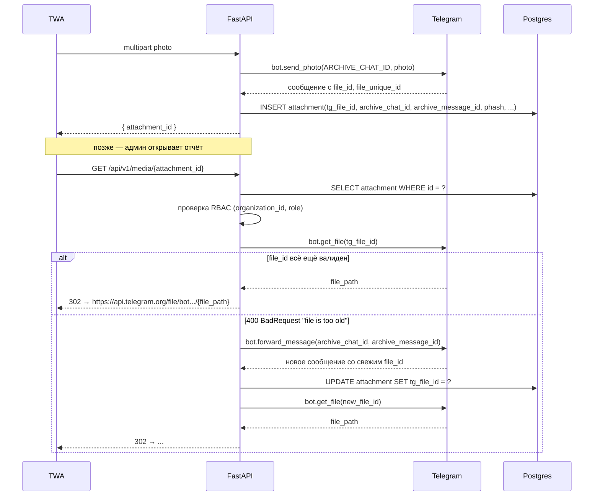

# Хранилище — Telegram-only с абстракцией `StorageProvider`

## Почему Telegram сначала

- Нулевая стоимость инфраструктуры во время пилота — критично для
  bootstrap-SaaS.
- Один глобальный бот (см. ADR-003) делает `file_id`'ы стабильными в
  нашем сценарии.
- `bot.send_photo` / `getFile` закрывают всё, что нужно для V0.

Мы осознанно принимаем три риска (см. ADR-002):

- Время жизни `file_id` формально не гарантируется — митигировано
  параллельным хранением `(archive_chat_id, archive_message_id)`,
  чтобы можно было `forward_message`'ом обновить `file_id`.
- ToS Telegram явно не разрешает коммерческое использование как CDN —
  митигировано абстракцией `StorageProvider`: переезд на Cloudflare R2
  занимает день, если Telegram прижмёт.
- Потолок 20 МБ на `getFile`-загрузке — для фото норм, для видео нет.
  V0 отклоняет неизображения на стороне сервера.

## Интерфейс провайдера

```python
@dataclass(frozen=True)
class AttachmentRef:
    provider: Literal["telegram", "r2"]
    tg_file_id: str | None = None
    tg_archive_chat_id: int | None = None
    tg_archive_message_id: int | None = None
    r2_object_key: str | None = None
    mime: str = "image/jpeg"
    size_bytes: int = 0


class StorageProvider(Protocol):
    async def upload(self, file: bytes, mime: str, meta: dict) -> AttachmentRef: ...
    async def get_url(self, ref: AttachmentRef, ttl_seconds: int = 3600) -> str: ...
```

## TelegramStorage



URL от `getFile` валиден ~1 час; мы 302-редиректим клиента прямо на него
(не проксируем байты через свой сервер) — egress остаётся на CDN
Telegram.

## R2Storage (V2)

- `upload`: серверный `PUT` в R2 через boto3 / aioboto3 с байтами
  пользователя; `r2_object_key = f"{org_id}/{shift_id}/{uuid4()}.jpg"`.
- `get_url`: presigned GET, TTL = 3600.
- План миграции с V0: backfill-скрипт читает каждую строку
  `attachments`, скачивает через `bot.get_file`, заливает в R2,
  обновляет `storage_provider = 'r2'` и `r2_object_key`. Прокси-эндпоинт
  не меняется.

## Прокси-эндпоинт

`GET /api/v1/media/{attachment_id}` обязателен для любого просмотра фото,
включая Telegram-сообщения админу. Зачем прокси:

- Принудительный RBAC (оператор не видит фото чужой смены).
- Скрывает провайдера хранилища от клиента — миграция V0→V2 прозрачна.
- Позволяет вести серверный аудит «кто и когда смотрел какое фото».

## Зеркалирование в группу админов

После успешной загрузки мы кладём задачу `mirror_to_admin_group`,
которая постит копию фото (или media-группу на закрытии смены) в чат
админов с подписью-метаданными. Это и есть «умная лента», обещанная в
спеке.
