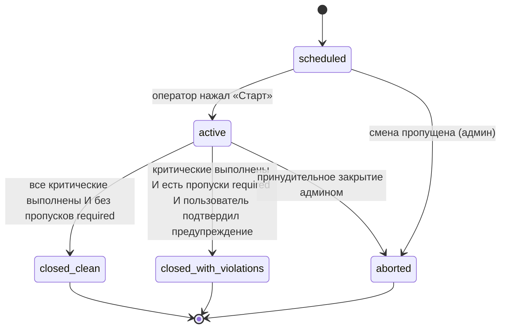
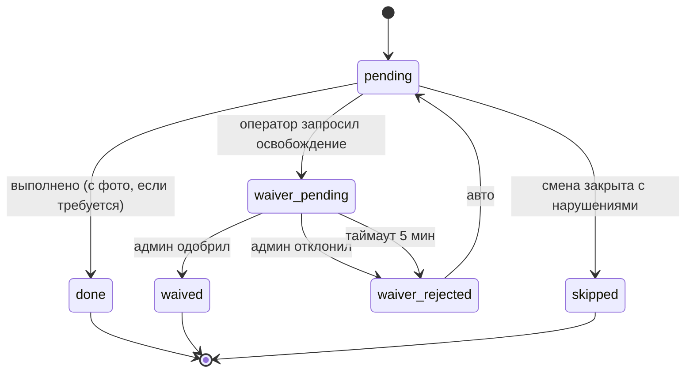

# UX-флоу — конечный автомат и крайние случаи

## Конечный автомат смены

## Конечный автомат задачи

## Критические крайние случаи

### EC-1 — Сеть отвалилась во время загрузки фото

- TWA держит фото в IndexedDB через очередь Workbox Background Sync.
- В UI на карточке задачи видна маленькая плашка «в очереди — повтор
  при появлении сети».
- При возврате связи очередь повторяет
  `POST /tasks/{id}/complete`. Если задача уже была выполнена другим
  путём (админ оверрайдом) — бэкенд отвечает
  409 `task_already_completed`, и очередь молча выбрасывает запись.

### EC-2 — Смена перекатывается за плановое окончание

- Смена **не** закрывается автоматически. Мы никогда не хотим тихо
  отметить смену закрытой без подтверждения оператора.
- В T+30 мин после планового окончания оператору летит толчок: «Смена
  за плановым окончанием. Закройте сейчас или укажите причину задержки»
  (поле причины задержки — V2).

### EC-3 — Оператор ушёл в оффлайн посреди смены и вернулся позже

- TWA восстанавливает состояние из IndexedDB-кэша смены.
- На реконнекте подтягивает каноническое состояние из API (где могли
  быть правки админа) и мирится с ним.

### EC-4 — Критическая задача физически невозможна

- Оператор тапает «Не могу выполнить» → waiver-флоу (S4).
- Обязательно: фото причины + чип-причина + свободный текст.
- Админ видит инлайн-кнопки в личке.
- SLA 5 минут: если решения нет, статус возвращается в `pending` и
  стреляет более громкое напоминание.

### EC-5 — Подозрительное фото (phash-коллизия)

- Сервер ставит `suspicious=true` и шлёт в чат админов уведомление с
  обоими фото рядом.
- Задача **не** отклоняется автоматически — только помечается. Решает
  админ.
- Так мы избегаем фрустрации от ложных срабатываний (например, один и
  тот же ракурс каждое утро естественно похож).

### EC-6 — Пользователь потерял доступ к Telegram (потерял телефон)

- Админ может перевыдать приглашение через `/invite @username` в чате
  админов.
- Старая строка `telegram_accounts.tg_user_id` сохраняется для аудита,
  но `is_active` переключается в false.

### EC-7 — Смена часового пояса (DST, путешествующий собственник)

- Времена всегда хранятся в UTC. Отображение — по
  `location.timezone`.
- Расписания, сгенерённые на «08:00 по местному», остаются корректными
  через DST.
- Собственник из ЕС видит дашборд в своём локальном TZ через
  `Intl.DateTimeFormat` с override `location.timezone` на карточках.

### EC-8 — Два оператора на одной смене (передача)

- V0: не поддерживается. У смены один `operator_user_id`.
- V2: появится таблица `shift_assignments` (many-to-one) с
  `started_at` / `ended_at` на каждого оператора.

### EC-9 — Fallback в галерею на iOS

- На iOS `<input capture="environment">` — best-effort. Система может
  показать выбор. Мы помечаем такое вложение
  `capture_method = "fallback"` и тихо предупреждаем админа.

### EC-10 — Арендатор пробует посмотреть медиа другого арендатора

- RLS блокирует SELECT в прокси-эндпоинте — он отвечает 404, а не 403,
  чтобы не утечь сам факт существования.
