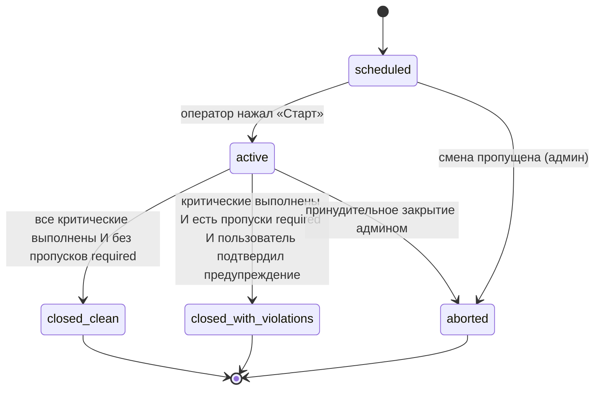
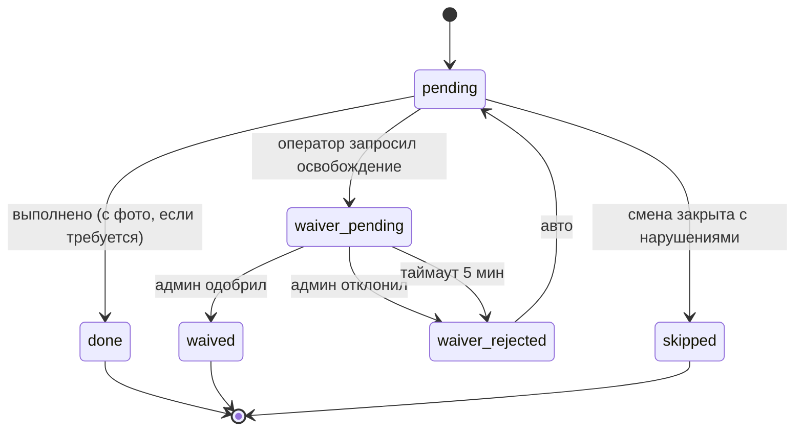

# UX-флоу — конечный автомат и крайние случаи

**Визуальная система** (цвета, фон, типографика): [`DESIGN_SYSTEM.md`](DESIGN_SYSTEM.md). Интерактивный **макет без прод-кода**: [`shiftops-demo.html`](shiftops-demo.html) — только для согласования UI; сценарии и данные в этом репозитории задаёт TWA + API, не демо-скрипт.

## Конечный автомат смены

## Конечный автомат задачи

## Peer-swap запланированных смен

- Доступно только для смен в статусе `scheduled` с назначенными
  операторами на обеих сторонах (пустые слоты пула сначала **claim**).
- Инициатор создаёт запрос (`POST /v1/shifts/swap-requests`); контрагент
  принимает или отклоняет. При принятии в одной транзакции меняются
  `operator_user_id` у двух смен; статусы остаются `scheduled`.
- TWA: экран «Обмен сменами» — список входящих/исходящих и форма нового
  запроса (своя запланированная смена + UUID смены коллеги).

## Критические крайние случаи

### EC-1 — Сеть отвалилась во время загрузки фото

- TWA держит фото в IndexedDB через очередь Workbox Background Sync.
- В UI на карточке задачи видна маленькая плашка «в очереди — повтор
  при появлении сети».
- При возврате связи очередь повторяет
  `POST /tasks/{id}/complete`. Если задача уже была выполнена другим
  путём (админ оверрайдом) — бэкенд отвечает
  409 `task_already_completed`, и очередь молча выбрасывает запись.

### EC-1b — Оффлайн в момент закрытия смены (в т.ч. с причиной задержки)

- Сейчас оффлайн-очередь Service Worker **ориентирована на задачи**
  (complete task / загрузка вложений). Закрытие смены — отдельный
  критичный запрос: `POST /v1/shifts/{id}/close` с телом
  `confirm_violations` и опционально `delay_reason` (переработка).
- **Целевое поведение (продукт):** при отсутствии сети в момент «Закрыть
  смену» тот же механизм best-effort должен **поставить в очередь** запрос
  закрытия вместе с причиной задержки; после восстановления связи —
  повтор с тем же телом. Конфликты: если смена уже закрыта другим каналом,
  ожидается ответ 409 / доменная ошибка — клиент снимает запись из
  очереди и синхронизирует состояние с `GET /v1/shifts/me` (или пустой
  ответ для закрытой смены).
- Пока реализация не доведена до паритета с задачами, в пилоте оператору
  нужно иметь связь для финального закрытия **или** принять риск ручного
  эскала админу — это следует явно проговаривать при онбординге.

### EC-2 — Смена перекатывается за плановое окончание

- Смена **не** закрывается автоматически. Мы никогда не хотим тихо
  отметить смену закрытой без подтверждения оператора.
- В T+30 мин после планового окончания оператору летит толчок: «Смена
  за плановым окончанием. Закройте сейчас или укажите причину задержки».
- При закрытии с переработкой (`actual_end` позже `scheduled_end`) TWA
  предлагает опциональное поле **причина задержки**; оно сохраняется в
  `shifts.delay_reason` и видно в истории.

### EC-3 — Оператор ушёл в оффлайн посреди смены и вернулся позже

- TWA восстанавливает состояние из IndexedDB-кэша смены.
- На реконнекте подтягивает каноническое состояние из API (где могли
  быть правки админа) и мирится с ним.

### EC-4 — Критическая задача физически невозможна

- Оператор тапает «Не могу выполнить» → waiver-флоу (S4).
- Обязательно: фото причины + чип-причина + свободный текст.
- Админ видит инлайн-кнопки в личке.
- SLA 5 минут: если решения нет, статус возвращается в `pending` и
  стреляет более громкое напоминание.

### EC-5 — Подозрительное фото (phash-коллизия)

- Сервер ставит `suspicious=true` и шлёт в чат админов уведомление с
  обоими фото рядом.
- Задача **не** отклоняется автоматически — только помечается. Решает
  админ.
- Так мы избегаем фрустрации от ложных срабатываний (например, один и
  тот же ракурс каждое утро естественно похож).

### EC-6 — Пользователь потерял доступ к Telegram (потерял телефон)

- Админ может перевыдать приглашение через `/invite @username` в чате
  админов.
- Старая строка `telegram_accounts.tg_user_id` сохраняется для аудита,
  но `is_active` переключается в false.

### EC-7 — Смена часового пояса (DST, путешествующий собственник)

- Времена всегда хранятся в UTC. Отображение — по
  `location.timezone`.
- Расписания, сгенерённые на «08:00 по местному», остаются корректными
  через DST.
- Собственник из ЕС видит дашборд в своём локальном TZ через
  `Intl.DateTimeFormat` с override `location.timezone` на карточках.

### EC-8 — Несколько человек на одной позиции / передача

- У каждой смены по-прежнему **один** ответственный (`operator_user_id`).
- **Несколько параллельных постов:** `templates.slot_count` > 1 и (опционально)
  `slot_labels` в `default_schedule`; воркер создаёт несколько строк `shifts`
  на один день (разные `slot_index`). Если включён **пул** (`unassigned_pool`),
  слоты создаются с `operator_user_id IS NULL`, сотрудник делает **claim**
  (`POST /v1/shifts/{id}/claim`) — атомарное назначение и старт.
  Конфликт при одновременном claim → **409** `shift_taken`; TWA обновляет список
  и показывает, что пост заняли. Незанятые слоты после `scheduled_end` воркер
  помечает **aborted**, чтобы не засорять дашборд.
- **Два разных чек-листа** (например основной бар / сервис-бар): два шаблона,
  у каждого свой `slot_count` (часто 1).
- Совместная работа **одного** чек-листа двумя людьми без разделения ответственности
  по-прежнему вне продукта; для общего списка задач нужны отдельные экземпляры смен.

### EC-9 — Fallback в галерею на iOS

- На iOS `<input capture="environment">` — best-effort. Система может
  показать выбор. Мы помечаем такое вложение
  `capture_method = "fallback"` и тихо предупреждаем админа.

### EC-10 — Арендатор пробует посмотреть медиа другого арендатора

- RLS блокирует SELECT в прокси-эндпоинте — он отвечает 404, а не 403,
  чтобы не утечь сам факт существования.

### EC-11 — Первый запуск TWA: онбординг

- При первом открытии Web App мы показываем экран
  [`OnboardingScreen`](../apps/web/components/screens/onboarding-screen.tsx)
  с тремя короткими блоками: «чек-листы смены», «anti-fake + балл качества»,
  «как начать (через инвайт)».
- Флаг `localStorage["shiftops:onboardingSeen"]="1"` ставится после нажатия
  CTA. На устройствах в приватном режиме ключ не записывается — онбординг
  покажется снова при следующем запуске; считаем это приемлемым.
- Бот дополнительно прокидывает `setMyDescription` /
  `setMyShortDescription` (см. [TELEGRAM_BOT.md](TELEGRAM_BOT.md)) —
  приветственный текст виден ещё до Start в пустом чате.

## Управление командой (TWA + бот)

- Раздел «Команда» в TWA: список участников с трёхточечным меню «Изменить
  роль» / «Удалить». Кнопки доступны только если бэкенд вернул
  `can_change_role: true` / `can_deactivate: true` (правила одинаковые: только
  владелец и платформенный super-admin). Нажатие открывает нижний sheet с
  выбором роли (`admin` / `operator` / `bartender`). Org `admin` может
  просматривать список, но не управлять ролями (пилотная политика; см.
  `ARCHITECTURE.md` и `ROADMAP.md`).
- **V1.1:** опциональная должность `job_title` под именем и в sheet смены роли;
  права не меняются — только подпись для людей. События в аудите: `member.updated`.
- В боте те же действия доступны владельцу через `/team_list`, `/set_role` и
  `/remove_member` как **fallback** при плохой сети. Super-admin использует
  `/org_set_role` / `/org_remove_member` с явным `org_uuid`. Полный список —
  в [TELEGRAM_BOT.md](TELEGRAM_BOT.md).
- Роль `owner` через эти потоки не выдаётся: единственный способ
  переназначить владельца — `/org_set_owner` (super-admin), что автоматически
  понижает прежнего owner до admin.
- Роль `bartender` — полноценная системная роль (шаблоны `role_target`,
  аналитика, инвайты), не «косметический тег» к `operator`.

## Авто-создание ежедневных смен

- В редакторе шаблона включён блок «Автосоздание смены»
  ([`template-edit-screen.tsx`](../apps/web/components/screens/template-edit-screen.tsx)):
  переключатель + время начала + длительность + дни недели + локация +
  оператор по умолчанию + lead-time (за сколько до начала создавать).
- При сохранении API валидирует, что `location_id` принадлежит организации
  актора, а `default_assignee_id` — активный сотрудник с подходящей ролью.
  Конфиг сериализуется в `templates.default_schedule` JSONB.
- TaskIQ-периодик `recurring_shifts_tick` (`apps/api/shiftops_api/infra/scheduling/tasks.py`)
  раз в минуту сканирует все шаблоны с `auto_create=true`, проверяет «сейчас
  попадаем в окно?» и идемпотентно создаёт `Shift` + `task_instances`.
- Идемпотентность: advisory-lock на ключ
  `recurring:<template_id>:<location_id>:<local_day>` плюс повторный
  existence-check после захвата лока. Дубль того же дня не создаётся даже
  при двух одновременно бегущих воркерах.
- Если `default_assignee_id` не задан — use case подбирает первого активного
  пользователя с `role == role_target` (или owner-fallback). Если в орге
  никого подходящего нет — смена не создаётся, в логах `recurring.tick.no_operator`.

## Bulk-импорт чек-листа из текста

- В редакторе нового шаблона есть кнопка «Импорт из текста»
  (Sheet с `<textarea>`). Парсер
  ([`bulk_parser.py`](../apps/api/shiftops_api/application/templates/bulk_parser.py))
  понимает заголовки `1. Название` / `## Название` (становятся секциями) и
  строки `☐ ...` / `- [ ] ...` (становятся задачами).
- Подсписки внутри секции (например, `Продукты:` со списком ингредиентов)
  схлопываются в одну композитную задачу с `description` — на телефоне
  12 микро-задач за «проверить продукты» убивают UX.
- Кнопка «Предпросмотр» вызывает `POST /v1/templates/import?dry_run=true`
  и показывает список секций + задач. «Применить» создаёт шаблон через
  тот же endpoint (без `dry_run`), что прокладывает событие
  `template.created` в audit-log.
- Все задачи импортируются как `criticality=required`, `requires_photo=false`.
  Владелец помечает критические/фото-обязательные пункты вручную в
  редакторе или через seed-скрипт (см. `seed_plovkhana_templates.py`).
